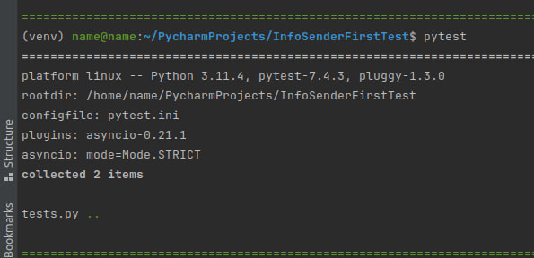

# Пересыльщик бот
Телеграм бот, который получает от пользователя данные: ФИО + скрин(одним постом).  
После этого бот пересылает эти данные в отдельный общий чат.


## Зависимости

Для работы микросервиса понадобятся Python версии 3.11, Docker и docker compose.


## Запуск
- Заполните переменные окружения в файле .env
    - BOT_TOKEN - токен вашего бота, можно получить в телеграмме у [Бота Бати](https://t.me/BotFather).
    - TO_SEND_CHAT_ID - id чата, куда будут пересылаться сообщения.


- Пропишите в консоли:
```bash
docker compose up --build
```

## Тестирование
Активируйте виртуальное окружение, установите зависимости и пропишите в консоли:
```bash
pytest
```

## Отчёт о тестировании

